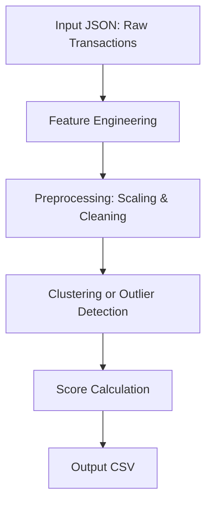

# Zeru DeFi Wallet Credit Scoring

This project provides a robust, transparent pipeline to assign a credit score (0–1000) to DeFi wallets based on their historical transaction behavior on the Aave V2 protocol. The approach is unsupervised and uses clustering/anomaly detection to group and score wallets.

---

## Methodology Overview

### Chosen Methods
- **Unsupervised Learning:** No ground-truth labels are required. I use clustering and anomaly detection to group wallets by behavioral similarity and flag outliers.
- **Multiple Algorithms:** The pipeline supports KMeans, DBSCAN, IsolationForest, Z-score, Mahalanobis distance, and Autoencoder-based anomaly detection. This flexibility allows for robust, extensible scoring.
- **Feature Engineering:** I extract a rich set of features from raw transaction logs, including behavioral counts, value-based metrics, diversity, temporal activity, and volatility.
- **Scoring:** Scores are a weighted combination of normalized features, anomaly/cluster information, volatility, and cluster reputation, all mapped to a 0–1000 scale.

### Why Unsupervised?
- DeFi lacks labeled “good” or “bad” wallet data. Unsupervised methods let us group and score wallets based on real behavioral patterns, not arbitrary rules.
- Outlier detection helps flag risky, bot-like, or exploitative behavior.

---

## Architecture



- **Input:** JSON file with transaction records (wallet, action, amount, asset, timestamp, etc.)
- **Feature Engineering:** I aggregate per-wallet features (counts, values, diversity, volatility, etc.)
- **Preprocessing:** I handle missing values, normalize features, and apply time-decay if enabled
- **Clustering/Outlier Detection:** I group wallets or flag outliers using the chosen method
- **Score Calculation:** I combine features, anomaly/cluster info, volatility, and cluster reputation into a final score
- **Output:** CSV with wallet scores, cluster labels, anomaly scores, and all features

---

## Processing Flow

1. **Data Ingestion:**
   - Reads a JSON file of raw transaction logs (one record per transaction).
2. **Feature Engineering:**
   - For each wallet, computes:
     - Transaction counts (deposits, borrows, redeems, etc.)
     - Value-based features (total deposit/borrow/redeem in USD, ratios)
     - Diversity (unique assets, action types)
     - Temporal (lifetime, activity frequency)
     - Volatility (std of daily tx counts)
     - Bot/risk patterns (e.g., borrow and redeem same day)
     - Optionally, applies time-decayed weights to recent transactions
3. **Preprocessing:**
   - Fills missing values, normalizes all numerical features
4. **Clustering/Outlier Detection:**
   - Groups wallets or flags outliers using the selected method (KMeans, DBSCAN, IsolationForest, Z-score, Mahalanobis, Autoencoder)
   - Computes cluster reputation for bonus/penalty
5. **Scoring:**
   - Weighted sum of normalized features, anomaly/cluster info, volatility, and cluster bonus/penalty
   - Final score is clipped to [0, 1000]
6. **Output:**
   - Saves a CSV (or JSON) with wallet address, score, cluster label, anomaly score, and all features

---

## Detailed Method Logic

### KMeans

**Mathematical Background:**
- KMeans partitions the feature space into \( k \) clusters by minimizing the within-cluster sum of squared Euclidean distances.
- For \( n \) wallets (feature vectors \( x_i \)), and \( k \) centroids \( \mu_j \), the objective is:
  \[
  \min_{\{\mu_j\}} \sum_{i=1}^n \min_{j \in \{1,...,k\}} \|x_i - \mu_j\|^2
  \]
- In this pipeline, \( k = 4 \) by default.

**Pipeline Steps:**
1. **Feature Engineering:**  
   - Each wallet is represented by a vector of engineered features (see code: `engineer_features`).
   - Features include transaction counts, value-based metrics, diversity, temporal, and volatility features.
2. **Feature Scaling:**  
   - All features (except wallet address, first/last tx time) are standardized using `StandardScaler` (zero mean, unit variance).
   - This ensures all features contribute equally to distance calculations.
3. **Clustering:**  
   - `KMeans(n_clusters=4, random_state=42)` is fit on the scaled feature matrix.
   - Each wallet is assigned a cluster label (0 to 3).
   - Cluster centroids are stored as a \( 4 \times d \) matrix (where \( d \) is the number of features).
4. **Best Cluster Selection:**  
   - The “best” cluster is defined as the one whose centroid has the highest value for the `total_deposit_usd` feature.
   - This is found by:
     ```python
     best_cluster = np.argmax(centroids[:, features_df.columns.get_loc('total_deposit_usd')])
     ```
5. **Anomaly Score Calculation:**  
   - For each wallet, compute the Euclidean distance from its scaled feature vector \( x_i \) to the best cluster centroid \( \mu_{best} \):
     \[
     d_i = \|x_i - \mu_{best}\|_2
     \]
   - Normalize all distances to [0, 1]:
     \[
     \text{anomaly\_score}_i = \frac{d_i - \min_j d_j}{\max_j d_j - \min_j d_j + 1e-9}
     \]
   - This score is higher for wallets farther from the “best” cluster (i.e., more anomalous/risky).
6. **Cluster-Based Bonus/Penalty:**  
   - For each cluster, compute a “reputation” as the mean of `total_deposit_usd + wallet_lifetime_days` for all wallets in the cluster.
   - Normalize cluster reputations to [0, 1], then map each wallet’s cluster to its normalized reputation.
   - The bonus/penalty is:
     \[
     \text{bonus}_i = (\text{reputation}_{c_i} - 0.5) \times 0.2
     \]
     where \( c_i \) is the cluster label for wallet \( i \).
   - This bonus is scaled to ±10% of the score and added to the final score.
7. **Final Score Calculation:**  
   - The final score for each wallet is:
     \[
     \text{score}_i = \Big[0.3 \cdot \text{normed\_deposit}_i + 0.2 \cdot \text{normed\_lifetime}_i + 0.2 \cdot (1 - \text{normed\_redeem\_ratio}_i) + 0.2 \cdot \text{normed\_txs\_per\_day}_i - 0.1 \cdot \text{anomaly\_score}_i - 0.1 \cdot \text{normed\_volatility}_i\Big] \times 1000 + \text{bonus}_i \times 1000
     \]
   - All feature components are min-max normalized to [0, 1] before weighting.
   - After all calculations, the entire score array is min-max normalized again to [0, 1000] to ensure a well-spread distribution.

**Parameters and Tuning:**
- `n_clusters`: Number of clusters (default: 4). Can be changed in the code.
- `random_state`: Fixed for reproducibility.
- All normalization and scaling steps are performed using scikit-learn’s `StandardScaler` and `MinMaxScaler`.
- The bonus/penalty scaling factor (0.2) and final normalization ensure scores are interpretable and comparable across runs.

**Caveats:**
- KMeans assumes clusters are spherical and of similar size; if your data violates this, results may be suboptimal.
- Sensitive to outliers and feature scaling.
- The “best” cluster is defined by deposit size, which may not always align with your business definition of “best.”

---

### DBSCAN

**Mathematical Background:**
- DBSCAN (Density-Based Spatial Clustering of Applications with Noise) groups points that are closely packed together (points with many nearby neighbors), and marks as outliers points that lie alone in low-density regions.
- Two main parameters:
  - `eps`: Maximum distance between two samples for them to be considered as in the same neighborhood (default: 1.5 in code).
  - `min_samples`: Minimum number of samples in a neighborhood for a point to be considered a core point (default: 5).
- DBSCAN does not require the number of clusters to be specified and can find arbitrarily shaped clusters.

**Pipeline Steps:**
1. **Feature Engineering & Scaling:**
   - Same as KMeans: engineered features, then standardized with `StandardScaler`.
2. **Clustering:**
   - `DBSCAN(eps=1.5, min_samples=5)` is fit on the scaled feature matrix.
   - Each wallet is assigned a cluster label (integer >= 0) or -1 (noise/outlier).
3. **Anomaly Score Calculation:**
   - For each wallet:
     - If `cluster_label == -1` (noise), set `anomaly_score = 1.0` (max risk).
     - Otherwise, set `anomaly_score = 0.0` (in-cluster, not anomalous).
   - This is implemented as:
     ```python
     anomaly_score = np.where(cluster_labels == -1, 1.0, 0.0)
     ```
4. **Cluster-Based Bonus/Penalty:**
   - For each cluster (excluding noise), compute a “reputation” as the mean of `total_deposit_usd + wallet_lifetime_days` for all wallets in the cluster.
   - Normalize cluster reputations to [0, 1].
   - For noise points (`cluster_label == -1`), assign the lowest reputation minus one (to ensure a strong penalty):
     ```python
     min_rep = cluster_reps.min() if len(cluster_reps) > 0 else 0
     cluster_reps = pd.concat([cluster_reps, pd.Series({-1: min_rep - 1})])
     ```
   - The bonus/penalty is:
     \[
     \text{bonus}_i = (\text{reputation}_{c_i} - 0.5) \times 0.2
     \]
     where \( c_i \) is the cluster label for wallet \( i \).
   - This bonus is scaled to ±10% of the score and added to the final score.
5. **Final Score Calculation:**
   - Same as KMeans: weighted sum of normalized features, minus anomaly score, minus volatility, plus cluster bonus/penalty, then min-max normalized to [0, 1000].

**Parameters and Tuning:**
- `eps`: Maximum neighborhood distance (default: 1.5). Controls cluster density sensitivity.
- `min_samples`: Minimum points to form a cluster (default: 5).
- No need to specify the number of clusters.
- All normalization and scaling steps are performed using scikit-learn’s `StandardScaler` and `MinMaxScaler`.

**Caveats:**
- If most points are in low-density regions, DBSCAN may label most wallets as noise (outliers), leading to high anomaly scores for many wallets.
- Sensitive to feature scaling and the choice of `eps` and `min_samples`.
- Clusters can be of arbitrary shape and size, but interpretation of clusters may be less intuitive than KMeans.

---

### IsolationForest

**Mathematical Background:**
- IsolationForest is an ensemble-based anomaly detection method that isolates observations by randomly selecting a feature and then randomly selecting a split value between the maximum and minimum values of the selected feature.
- The number of splits required to isolate a sample is equivalent to the path length from the root node to the terminating node. Anomalies are isolated more quickly and thus have shorter average path lengths.
- The anomaly score is based on the average path length over a forest of random trees.

**Pipeline Steps:**
1. **Feature Engineering & Scaling:**
   - Same as KMeans: engineered features, then standardized with `StandardScaler`.
2. **Model Fitting:**
   - `IsolationForest(n_estimators=100, contamination=0.1, random_state=42)` is fit on the scaled feature matrix.
   - `contamination` is the expected proportion of outliers in the data (default: 0.1).
3. **Anomaly Score Calculation:**
   - For each wallet, compute the anomaly score as the negative of the average path length (higher = more anomalous):
     ```python
     iforest.fit(X_scaled)
     anomaly_score = -iforest.score_samples(X_scaled)
     anomaly_score = (anomaly_score - anomaly_score.min()) / (anomaly_score.max() - anomaly_score.min() + 1e-9)
     ```
   - The score is normalized to [0, 1] across all wallets.
   - Cluster labels are assigned as 1 (outlier) if `anomaly_score > 0.7`, else 0 (inlier):
     ```python
     cluster_labels = (anomaly_score > 0.7).astype(int)
     ```
4. **Cluster-Based Bonus/Penalty:**
   - Not meaningful for IsolationForest, but the code applies the same bonus/penalty logic as for other methods (using the inlier/outlier labels as clusters).
   - The bonus/penalty is:
     \[
     \text{bonus}_i = (\text{reputation}_{c_i} - 0.5) \times 0.2
     \]
     where \( c_i \) is the cluster label (0 or 1) for wallet \( i \).
   - This bonus is scaled to ±10% of the score and added to the final score.
5. **Final Score Calculation:**
   - Same as KMeans: weighted sum of normalized features, minus anomaly score, minus volatility, plus cluster bonus/penalty, then min-max normalized to [0, 1000].

**Parameters and Tuning:**
- `n_estimators`: Number of trees in the forest (default: 100).
- `contamination`: Proportion of outliers expected (default: 0.1).
- All normalization and scaling steps are performed using scikit-learn’s `StandardScaler` and `MinMaxScaler`.

**Caveats:**
- The anomaly score is relative to the data distribution; if the data is highly imbalanced, the threshold for outliers may not be optimal.
- The cluster label (0/1) is a post-processing step for bonus/penalty and does not correspond to true clusters.
- Sensitive to the `contamination` parameter; tuning may be required for different datasets.

---

### Z-score

**Mathematical Background:**
- Z-score is a statistical measure that quantifies the number of standard deviations a data point is from the mean of the distribution.
- For each feature, the Z-score for wallet \( i \) and feature \( j \) is:
  \[
  z_{ij} = \frac{x_{ij} - \mu_j}{\sigma_j + 1e-9}
  \]
  where \( x_{ij} \) is the scaled value, \( \mu_j \) is the mean, and \( \sigma_j \) is the standard deviation of feature \( j \).

**Pipeline Steps:**
1. **Feature Engineering & Scaling:**
   - Same as KMeans: engineered features, then standardized with `StandardScaler`.
2. **Z-score Calculation:**
   - For each wallet, compute the absolute Z-score for each feature.
   - The anomaly score for each wallet is the maximum absolute Z-score across all features:
     \[
     \text{anomaly\_score}_i = \max_j |z_{ij}|
     \]
   - Normalize all anomaly scores to [0, 1]:
     ```python
     mean = X_scaled.mean(axis=0)
     std = X_scaled.std(axis=0) + 1e-9
     zscores = np.abs((X_scaled - mean) / std)
     anomaly_score = zscores.max(axis=1)
     anomaly_score = (anomaly_score - anomaly_score.min()) / (anomaly_score.max() - anomaly_score.min() + 1e-9)
     ```
   - All cluster labels are set to 0 (no clustering):
     ```python
     cluster_labels = np.zeros(len(anomaly_score), dtype=int)
     ```
3. **Cluster-Based Bonus/Penalty:**
   - Not meaningful for Z-score, but the code applies the same bonus/penalty logic as for other methods (all wallets in a single cluster).
   - The bonus/penalty is:
     \[
     \text{bonus}_i = (\text{reputation}_{c_i} - 0.5) \times 0.2
     \]
     where \( c_i = 0 \) for all wallets.
   - This bonus is scaled to ±10% of the score and added to the final score.
4. **Final Score Calculation:**
   - Same as KMeans: weighted sum of normalized features, minus anomaly score, minus volatility, plus cluster bonus/penalty, then min-max normalized to [0, 1000].

**Parameters and Tuning:**
- No hyperparameters; Z-score is a purely statistical method.
- All normalization and scaling steps are performed using scikit-learn’s `StandardScaler` and `MinMaxScaler`.

**Caveats:**
- Assumes features are approximately normally distributed after scaling.
- Sensitive to outliers; a single extreme value can dominate the anomaly score.
- No true clustering; all wallets are treated as a single group for bonus/penalty.

---

### Mahalanobis

**Mathematical Background:**
- Mahalanobis distance measures the distance between a point and a distribution, taking into account the correlations of the data set.
- For a wallet feature vector \( x \), the mean vector \( \mu \), and the covariance matrix \( S \), the Mahalanobis distance is:
  \[
  D_M(x) = \sqrt{(x - \mu)^T S^{-1} (x - \mu)}
  \]
- This distance is higher for points that are far from the mean, considering the feature covariance structure.

**Pipeline Steps:**
1. **Feature Engineering & Scaling:**
   - Same as KMeans: engineered features, then standardized with `StandardScaler`.
2. **Mahalanobis Distance Calculation:**
   - Compute the mean vector and covariance matrix of the scaled features.
   - For each wallet, compute the Mahalanobis distance to the mean:
     ```python
     mean = X_scaled.mean(axis=0)
     cov = np.cov(X_scaled, rowvar=False)
     cov_inv = np.linalg.pinv(cov)
     mahal = np.array([distance.mahalanobis(x, mean, cov_inv) for x in X_scaled])
     anomaly_score = (mahal - mahal.min()) / (mahal.max() - mahal.min() + 1e-9)
     ```
   - The anomaly score is the normalized Mahalanobis distance (higher = more anomalous).
   - All cluster labels are set to 0 (no clustering):
     ```python
     cluster_labels = np.zeros(len(anomaly_score), dtype=int)
     ```
3. **Cluster-Based Bonus/Penalty:**
   - Not meaningful for Mahalanobis, but the code applies the same bonus/penalty logic as for other methods (all wallets in a single cluster).
   - The bonus/penalty is:
     \[
     \text{bonus}_i = (\text{reputation}_{c_i} - 0.5) \times 0.2
     \]
     where \( c_i = 0 \) for all wallets.
   - This bonus is scaled to ±10% of the score and added to the final score.
4. **Final Score Calculation:**
   - Same as KMeans: weighted sum of normalized features, minus anomaly score, minus volatility, plus cluster bonus/penalty, then min-max normalized to [0, 1000].

**Parameters and Tuning:**
- No hyperparameters; Mahalanobis is a purely statistical method.
- All normalization and scaling steps are performed using scikit-learn’s `StandardScaler` and `MinMaxScaler`.

**Caveats:**
- Assumes features are approximately normally distributed after scaling.
- Sensitive to outliers and to singular or ill-conditioned covariance matrices (handled in code with pseudo-inverse).
- No true clustering; all wallets are treated as a single group for bonus/penalty.

---

### Autoencoder

**Mathematical Background:**
- An autoencoder is a type of neural network used for unsupervised representation learning. It consists of an encoder that maps input data to a lower-dimensional latent space, and a decoder that reconstructs the input from this latent space.
- The reconstruction error (difference between input and output) is used as an anomaly score: higher error indicates more unusual (harder to reconstruct) data.

**Pipeline Steps:**
1. **Feature Engineering & Scaling:**
   - Same as KMeans: engineered features, then standardized with `StandardScaler`.
2. **Autoencoder Architecture:**
   - Implemented in PyTorch as a simple feedforward network:
     - Encoder: Linear(input_dim → input_dim//2) → ReLU → Linear(input_dim//2 → input_dim//4) → ReLU
     - Decoder: Linear(input_dim//4 → input_dim//2) → ReLU → Linear(input_dim//2 → input_dim)
   - The network is trained to minimize mean squared error (MSE) between input and reconstruction.
3. **Training:**
   - The autoencoder is trained for 100 epochs using Adam optimizer (lr=0.01) and MSE loss.
   - Training is performed on the entire scaled feature matrix.
4. **Anomaly Score Calculation:**
   - After training, the reconstruction error for each wallet is computed as the mean squared error between the input and output:
     ```python
     errors = ((recon - X_tensor) ** 2).mean(dim=1).numpy()
     anomaly_score = (errors - errors.min()) / (errors.max() - errors.min() + 1e-9)
     ```
   - The anomaly score is the normalized reconstruction error (higher = more anomalous).
   - All cluster labels are set to 0 (no clustering):
     ```python
     cluster_labels = np.zeros(len(anomaly_score), dtype=int)
     ```
5. **Cluster-Based Bonus/Penalty:**
   - Not meaningful for autoencoder, but the code applies the same bonus/penalty logic as for other methods (all wallets in a single cluster).
   - The bonus/penalty is:
     \[
     \text{bonus}_i = (\text{reputation}_{c_i} - 0.5) \times 0.2
     \]
     where \( c_i = 0 \) for all wallets.
   - This bonus is scaled to ±10% of the score and added to the final score.
6. **Final Score Calculation:**
   - Same as KMeans: weighted sum of normalized features, minus anomaly score, minus volatility, plus cluster bonus/penalty, then min-max normalized to [0, 1000].

**Parameters and Tuning:**
- Network architecture: 2 hidden layers (input_dim//2, input_dim//4), ReLU activations.
- Training: 100 epochs, Adam optimizer (lr=0.01), MSE loss.
- All normalization and scaling steps are performed using scikit-learn’s `StandardScaler` and `MinMaxScaler`.
- Requires PyTorch (`torch`) to be installed.

**Caveats:**
- Sensitive to network architecture and training parameters; more complex data may require deeper or wider networks.
- The anomaly score is relative to the training data; if the autoencoder overfits, it may not generalize well to new data.
- No true clustering; all wallets are treated as a single group for bonus/penalty.
- Training is unsupervised and may be non-deterministic due to random initialization.

---

## Why Different Methods?

Each unsupervised method (KMeans, DBSCAN, IsolationForest, Z-score, Mahalanobis, Autoencoder) detects patterns, clusters, and outliers in fundamentally different ways.

### 1. Different Mathematical Approaches
- **KMeans:** Groups wallets into a fixed number of clusters based on feature similarity. Scores are influenced by distance to the “best” cluster centroid. Assumes clusters are spherical and similar in size.
- **DBSCAN:** Finds clusters of arbitrary shape and labels points in low-density regions as “noise” (outliers). If your data is mostly “noise” to DBSCAN, most wallets will be penalized, and only a few will be in clusters.
- **IsolationForest:** Treats outliers as those that are easiest to “isolate” in a random forest. Sensitive to the global distribution and can flag rare behaviors as highly anomalous.
- **Z-score/Mahalanobis:** Measures how far each wallet is from the “center” of the feature space. If your data is skewed, most points will be close to the mean, and a few will be far away.
- **Autoencoder:** Learns to reconstruct “normal” behavior. Wallets that are hard to reconstruct (i.e., unusual) get high anomaly scores.

### 2. Feature Sensitivity
- Each method reacts differently to the distribution and scaling of your features. If your data has many wallets with very similar behavior, some methods (like KMeans) may group them all together, while others (like IsolationForest or DBSCAN) may see most as outliers.

### 3. Parameter Sensitivity
- **KMeans:** Number of clusters (`n_clusters`)
- **DBSCAN:** `eps` (distance threshold), `min_samples`
- **IsolationForest:** `contamination` (expected outlier proportion)
- **Autoencoder:** Network size, training epochs, etc.

Small changes in these parameters can lead to very different groupings and, therefore, different score distributions.

### 4. Score Normalization
- After anomaly/cluster scoring, the pipeline normalizes scores to [0, 1000]. If the underlying anomaly/cluster scores are distributed differently, the normalization will stretch or compress the results accordingly.

### 5. Interpretation
- **No method is “right” or “wrong”**—each provides a different lens on the data. One may want to compare methods and choose the one that best matches the intuition or business goals (e.g., do you want to penalize rare behaviors, or reward cluster membership?).

---

## Extensibility & Transparency
- All logic is in a single, well-commented script
- Features and scoring logic are documented for auditability
- Easy to add new features, methods, or adjust weights

---

For setup and usage, see `setup.md`. For scoring logic and feature details, see below or the code comments. 
