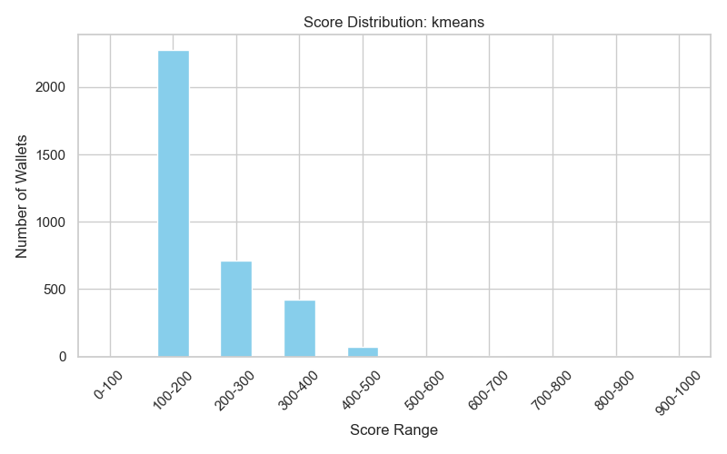
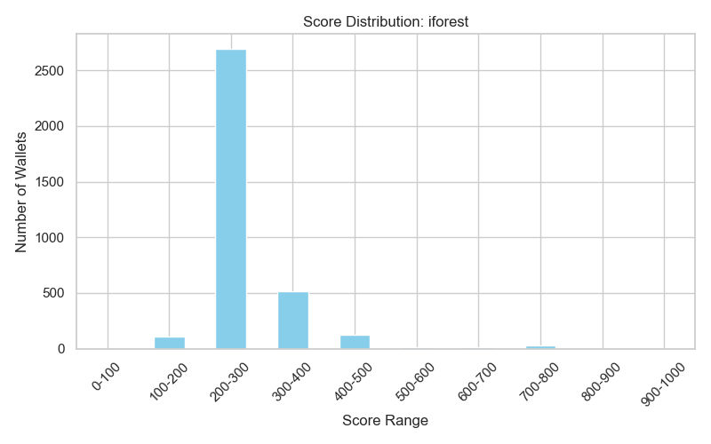
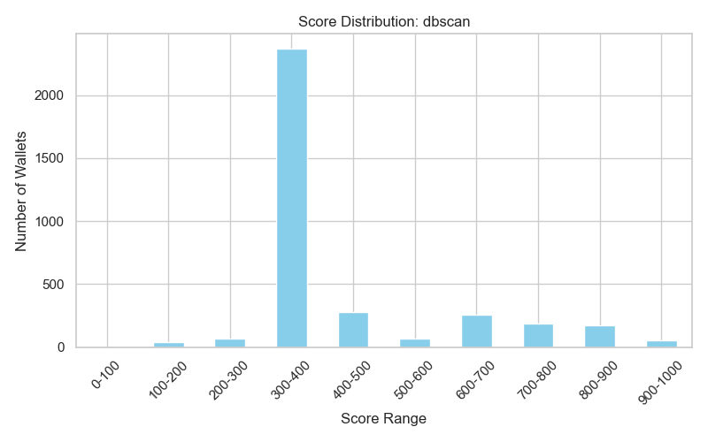
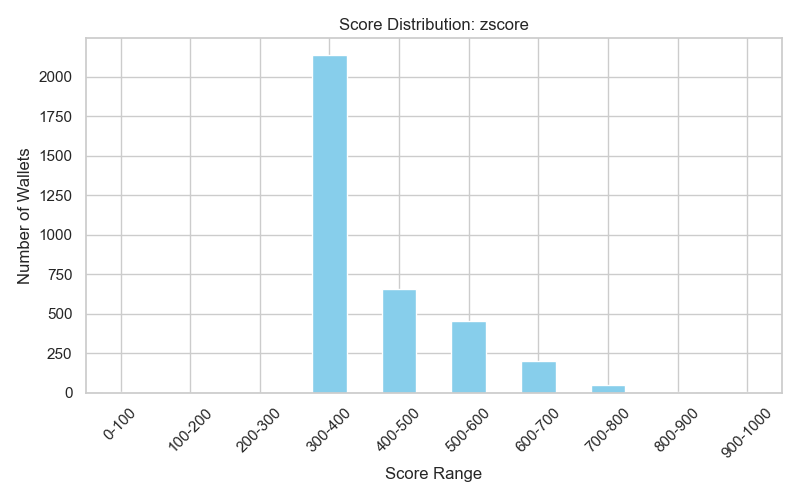
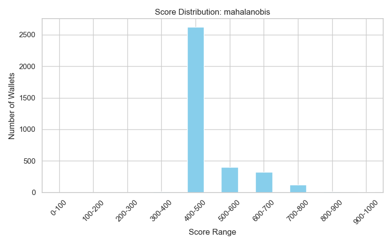
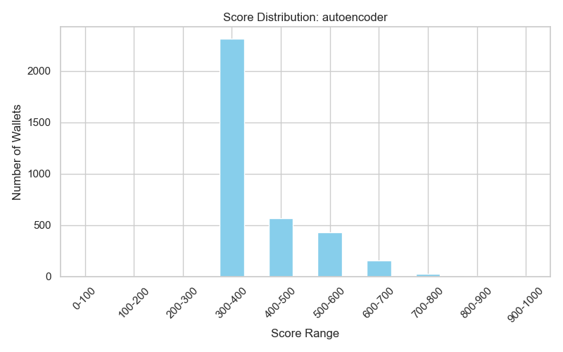

# Wallet Score Analysis (All Methods)

## Kmeans

### Score Bin Summary
| score_bin   |   total_deposit_usd |   wallet_lifetime_days |   redeem_to_deposit_ratio |   tx_volatility |   total_transactions |   num_wallets |
|:------------|--------------------:|-----------------------:|--------------------------:|----------------:|---------------------:|--------------:|
| 0-100       |         1.88221e+06 |               91       |               4.71222e+16 |        1.40789  |             13       |             1 |
| 100-200     |         1.81716e+21 |                2.45822 |               1.5132e+09  |        0.436058 |              3.90062 |          2274 |
| 200-300     |         6.93223e+22 |               36.0532  |               7.2177e+10  |        2.48248  |             36.605   |           714 |
| 300-400     |         1.48414e+23 |               84.5247  |               1.56395e+10 |        3.08798  |            117.275   |           425 |
| 400-500     |         7.44293e+23 |              126.107   |               0.477706    |        3.57026  |            186.92    |            75 |
| 500-600     |       nan           |              nan       |             nan           |      nan        |            nan       |             0 |
| 600-700     |         1.4687e+25  |               25.6667  |               0.921403    |        4.60651  |             49.6667  |             3 |
| 700-800     |       nan           |              nan       |             nan           |      nan        |            nan       |             0 |
| 800-900     |         3.80482e+25 |               32.6667  |               0.723531    |       13.5656   |            214       |             3 |
| 900-1000    |         4.53349e+25 |               81       |               0.698369    |       11.1573   |            164.5     |             2 |

**Behavior in Low Score Range (0-200):**
- Avg deposit: 9.09e+20, Lifetime: 46.7, Redeem/Deposit: 23561077302440560.00, Volatility: 0.92, Tx count: 8.5
  - Typically: high redeem-to-deposit, short lifetime, high volatility, low activity.
**Behavior in High Score Range (800-1000):**
- Avg deposit: 4.17e+25, Lifetime: 56.8, Redeem/Deposit: 0.71, Volatility: 12.36, Tx count: 189.2
  - Typically: large/consistent deposits, long lifetime, low redeem-to-deposit, low volatility, steady activity.

## Iforest

### Score Bin Summary
| score_bin   |   total_deposit_usd |   wallet_lifetime_days |   redeem_to_deposit_ratio |   tx_volatility |   total_transactions |   num_wallets |
|:------------|--------------------:|-----------------------:|--------------------------:|----------------:|---------------------:|--------------:|
| 0-100       |         1.88221e+06 |               91       |               4.71222e+16 |        1.40789  |             13       |             1 |
| 100-200     |         1.32625e+23 |                7.16038 |               3.69583e+10 |        5.44251  |             39.9057  |           106 |
| 200-300     |         8.78894e+21 |                7.68822 |               1.89736e+10 |        0.663132 |              9.34522 |          2691 |
| 300-400     |         5.98225e+22 |               71.0485  |               1.29064e+10 |        2.31254  |             53.5087  |           515 |
| 400-500     |         6.93599e+22 |              110.183   |               0.862158    |        2.01788  |             61.746   |           126 |
| 500-600     |         1.84468e+24 |               54.4167  |               0.592158    |       12.5211   |            410.167   |            12 |
| 600-700     |         4.69709e+24 |               66.5     |               0.798338    |        8.39862  |            424.786   |            14 |
| 700-800     |         1.90499e+24 |              121.667   |               0.485096    |       10.5045   |            867.852   |            27 |
| 800-900     |         3.80482e+25 |               32.6667  |               0.723531    |       13.5656   |            214       |             3 |
| 900-1000    |         4.53349e+25 |               81       |               0.698369    |       11.1573   |            164.5     |             2 |

**Behavior in Low Score Range (0-200):**
- Avg deposit: 6.63e+22, Lifetime: 49.1, Redeem/Deposit: 23561095024975360.00, Volatility: 3.43, Tx count: 26.5
  - Typically: high redeem-to-deposit, short lifetime, high volatility, low activity.
**Behavior in High Score Range (800-1000):**
- Avg deposit: 4.17e+25, Lifetime: 56.8, Redeem/Deposit: 0.71, Volatility: 12.36, Tx count: 189.2
  - Typically: large/consistent deposits, long lifetime, low redeem-to-deposit, low volatility, steady activity.

## Dbscan

### Score Bin Summary
| score_bin   |   total_deposit_usd |   wallet_lifetime_days |   redeem_to_deposit_ratio |   tx_volatility |   total_transactions |   num_wallets |
|:------------|--------------------:|-----------------------:|--------------------------:|----------------:|---------------------:|--------------:|
| 0-100       |         1.88221e+06 |               91       |               4.71222e+16 |        1.40789  |              13      |             1 |
| 100-200     |         2.06883e+23 |                8.02564 |               0.753984    |        8.73086  |              60      |            39 |
| 200-300     |         5.97462e+23 |               46.2113  |               1.5521e+10  |        6.53123  |             144.254  |            71 |
| 300-400     |         3.50753e+22 |                8.04394 |               1.63286e+09 |        0.471994 |              11.3599 |          2367 |
| 400-500     |         2.01453e+23 |               67.3714  |               1.91061e+11 |        2.26781  |             108.439  |           280 |
| 500-600     |         1.68296e+24 |               92.8406  |               0.399571    |        1.5317   |              27.6232 |            69 |
| 600-700     |         9.72241e+21 |                8.50973 |               8.32969e+09 |        1.78826  |              14.6576 |           257 |
| 700-800     |         5.24523e+23 |               38.709   |               5.38301e+09 |        3.47082  |              44.3862 |           189 |
| 800-900     |         4.59668e+22 |               79.1734  |               5.13401     |        2.93231  |              67.4046 |           173 |
| 900-1000    |         1.13211e+23 |              116.588   |               0.63556     |        2.6689   |              86.8627 |            51 |

**Behavior in Low Score Range (0-200):**
- Avg deposit: 1.03e+23, Lifetime: 49.5, Redeem/Deposit: 23561076545842272.00, Volatility: 5.07, Tx count: 36.5
  - Typically: high redeem-to-deposit, short lifetime, high volatility, low activity.
**Behavior in High Score Range (800-1000):**
- Avg deposit: 7.96e+22, Lifetime: 97.9, Redeem/Deposit: 2.88, Volatility: 2.80, Tx count: 77.1
  - Typically: large/consistent deposits, long lifetime, low redeem-to-deposit, low volatility, steady activity.

## Zscore

### Score Bin Summary
| score_bin   |   total_deposit_usd |   wallet_lifetime_days |   redeem_to_deposit_ratio |   tx_volatility |   total_transactions |   num_wallets |
|:------------|--------------------:|-----------------------:|--------------------------:|----------------:|---------------------:|--------------:|
| 0-100       |         1.88221e+06 |               91       |               4.71222e+16 |         1.40789 |             13       |             1 |
| 100-200     |       nan           |              nan       |             nan           |       nan       |            nan       |             0 |
| 200-300     |       nan           |              nan       |             nan           |       nan       |            nan       |             0 |
| 300-400     |         3.62719e+21 |                1.95229 |               1.45888e+09 |         0.40529 |              3.64172 |          2138 |
| 400-500     |         6.70312e+22 |               24.7134  |               7.71647e+10 |         2.13804 |             26.8643  |           656 |
| 500-600     |         1.77476e+23 |               66.9379  |               1.74476e+10 |         3.06313 |             99.1818  |           451 |
| 600-700     |         2.14456e+23 |              100.945   |               7.16105e+07 |         2.7667  |            102.025   |           199 |
| 700-800     |         2.33885e+24 |              126.184   |               0.56932     |         3.49844 |            177.408   |            49 |
| 800-900     |         4.16823e+25 |               42       |               0.418755    |        26.2283  |            522       |             1 |
| 900-1000    |         4.53349e+25 |               81       |               0.698369    |        11.1573  |            164.5     |             2 |

**Behavior in Low Score Range (0-200):**
- Avg deposit: 1.88e+06, Lifetime: 91.0, Redeem/Deposit: 47122153091684544.00, Volatility: 1.41, Tx count: 13.0
  - Typically: high redeem-to-deposit, short lifetime, high volatility, low activity.
**Behavior in High Score Range (800-1000):**
- Avg deposit: 4.35e+25, Lifetime: 61.5, Redeem/Deposit: 0.56, Volatility: 18.69, Tx count: 343.2
  - Typically: large/consistent deposits, long lifetime, low redeem-to-deposit, low volatility, steady activity.

## Mahalanobis

### Score Bin Summary
| score_bin   |   total_deposit_usd |   wallet_lifetime_days |   redeem_to_deposit_ratio |   tx_volatility |   total_transactions |   num_wallets |
|:------------|--------------------:|-----------------------:|--------------------------:|----------------:|---------------------:|--------------:|
| 0-100       |         1.88221e+06 |               91       |               4.71222e+16 |        1.40789  |             13       |             1 |
| 100-200     |       nan           |              nan       |             nan           |      nan        |            nan       |             0 |
| 200-300     |       nan           |              nan       |             nan           |      nan        |            nan       |             0 |
| 300-400     |         3.72736e+23 |                5.16667 |               0.689025    |       13.3327   |             50.6667  |            12 |
| 400-500     |         1.52686e+22 |                5.2704  |               2.66877e+09 |        0.678172 |              7.75362 |          2622 |
| 500-600     |         1.61115e+23 |               51.2105  |               1.20245e+11 |        2.63041  |             54.807   |           399 |
| 600-700     |         1.40805e+23 |               82.4801  |               2.03266e+10 |        2.93771  |            116.621   |           327 |
| 700-800     |         7.37718e+23 |              115.762   |               0.815191    |        3.18863  |            137.91    |           122 |
| 800-900     |         7.15791e+24 |              123.333   |               0.446932    |        5.11865  |            157.667   |            12 |
| 900-1000    |         4.53349e+25 |               81       |               0.698369    |       11.1573   |            164.5     |             2 |

**Behavior in Low Score Range (0-200):**
- Avg deposit: 1.88e+06, Lifetime: 91.0, Redeem/Deposit: 47122153091684544.00, Volatility: 1.41, Tx count: 13.0
  - Typically: high redeem-to-deposit, short lifetime, high volatility, low activity.
**Behavior in High Score Range (800-1000):**
- Avg deposit: 2.62e+25, Lifetime: 102.2, Redeem/Deposit: 0.57, Volatility: 8.14, Tx count: 161.1
  - Typically: large/consistent deposits, long lifetime, low redeem-to-deposit, low volatility, steady activity.

## Autoencoder

### Score Bin Summary
| score_bin   |   total_deposit_usd |   wallet_lifetime_days |   redeem_to_deposit_ratio |   tx_volatility |   total_transactions |   num_wallets |
|:------------|--------------------:|-----------------------:|--------------------------:|----------------:|---------------------:|--------------:|
| 0-100       |         1.88221e+06 |               91       |               4.71222e+16 |        1.40789  |             13       |             1 |
| 100-200     |       nan           |              nan       |             nan           |      nan        |            nan       |             0 |
| 200-300     |       nan           |              nan       |             nan           |      nan        |            nan       |             0 |
| 300-400     |         4.12667e+21 |                2.66724 |               1.48704e+09 |        0.471146 |              4.16335 |          2314 |
| 400-500     |         5.90758e+22 |               32.8936  |               8.95978e+10 |        2.42158  |             33.5798  |           564 |
| 500-600     |         2.21366e+23 |               73.2199  |               1.77038e+10 |        2.84534  |             74.963   |           432 |
| 600-700     |         2.68167e+23 |              109.936   |               0.825392    |        2.75226  |            113.287   |           157 |
| 700-800     |         2.70026e+24 |              129.16    |               0.436112    |        9.83799  |            812.8     |            25 |
| 800-900     |         4.13125e+25 |               22       |               0.707366    |       17.7599   |            297.5     |             2 |
| 900-1000    |         4.53349e+25 |               81       |               0.698369    |       11.1573   |            164.5     |             2 |

**Behavior in Low Score Range (0-200):**
- Avg deposit: 1.88e+06, Lifetime: 91.0, Redeem/Deposit: 47122153091684544.00, Volatility: 1.41, Tx count: 13.0
  - Typically: high redeem-to-deposit, short lifetime, high volatility, low activity.
**Behavior in High Score Range (800-1000):**
- Avg deposit: 4.33e+25, Lifetime: 51.5, Redeem/Deposit: 0.70, Volatility: 14.46, Tx count: 231.0
  - Typically: large/consistent deposits, long lifetime, low redeem-to-deposit, low volatility, steady activity.

---
This analysis was generated automatically for all methods.
